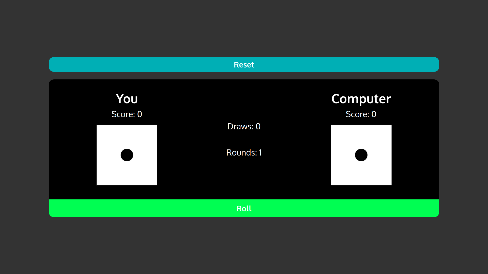

The purpose of this project was to practice to practice basic React (I got rusty).

Visit this project live at: https://jmart6784.github.io/react-dice/

OR

Run the project locally (prerequisites: yarn, npm):

1. Download or clone the repository.
2. Open the terminal inside the root of the project and run:
3. yarn install
4. yarn start
